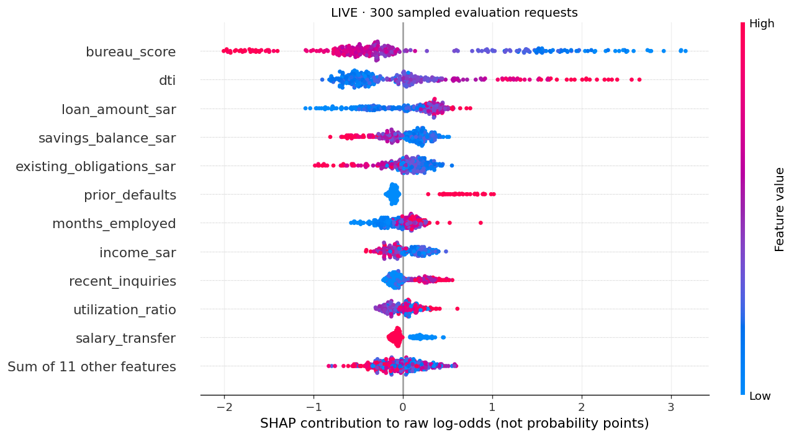
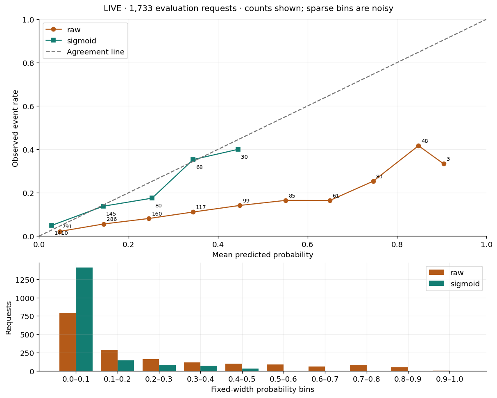
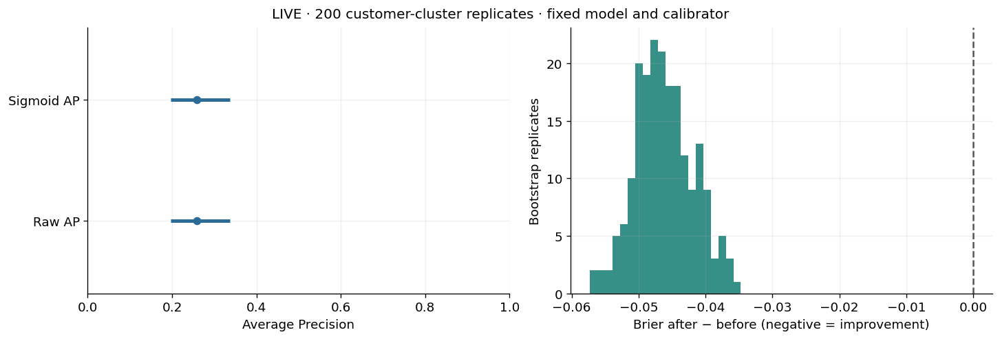
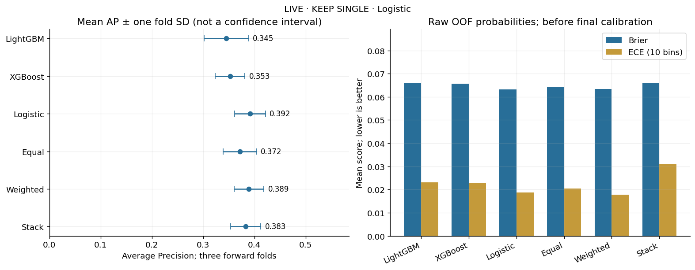

# DSC211-Tamweel-Dana
# Tamweel Lite
### From Credit-Risk Prediction to a Governed Decision-Support System

> An end-to-end credit risk modelling project exploring a question that goes
> beyond predictive accuracy:
>
> **Can a model identify risk reliably, explain its predictions, and translate
> them into decisions that remain defensible under real operational constraints?**

Tamweel Lite follows the complete journey from an initial credit-risk model to
a validated decision-support workflow.

Rather than stopping when a model achieves a strong score, the project
progressively tests whether that performance survives leakage controls,
time-aware validation, customer separation, probability calibration,
explainability, cost-sensitive decision-making and operational capacity
constraints.

The final deliverables include reproducible notebooks, validation evidence,
model artifacts, technical documentation, predictions and a final presentation.

---

## The Problem

The modelling objective is to predict whether an applicant will **default
within 90 days**, using information that would have been available when the
application was assessed.

The initial modelling population contains approximately:

| | |
|---|---:|
| Applications | **10,000** |
| Candidate predictors | **22** |
| Default rate | **~7.9%** |
| Prediction horizon | **90 days** |

The low default rate immediately creates a modelling challenge.

A model predicting almost everyone as a non-default could appear highly
accurate while providing little value in identifying actual risk.

For that reason, this project does not ask only:

> **How accurate is the model?**

It asks:

> **Can it identify the risky cases, generalise to later applicants, produce
> meaningful probabilities, explain its behaviour and operate within the
> number of cases that can realistically be reviewed?**

---

# The Modelling Journey

The project was developed as five connected stages.

```text
DAY 1 DAY 2
Baseline → Honest Validation
↓ ↓
Which model? Can I trust the result?
↓
DAY 3 DAY 4
Decision Policy ← Explain & Calibrate
↓ ↓
What should Why this prediction?
we action? Can I trust the probability?
↓
DAY 5
Final Model & Operational Decision
↓
KEEP SINGLE → PRIORITISE → MONITOR
```

Each stage challenges an assumption made in the previous stage.

---

# 01 — A Strong Model Is Not Necessarily a Trustworthy Model

The journey begins with three candidate algorithms:

- Logistic Regression
- XGBoost
- LightGBM

The initial comparison produced:

| Model | ROC-AUC | Average Precision |
|---|---:|---:|
| **Logistic Regression** | **0.8213** | 0.3258 |
| **XGBoost** | 0.8124 | **0.3338** |
| **LightGBM** | 0.8138 | 0.3248 |


At first glance, there is no universal winner.

Logistic Regression achieves the strongest ROC-AUC, while XGBoost produces the
highest Average Precision.

Because the target is imbalanced, Average Precision provides particularly
useful evidence about the model's ability to retrieve positive cases. XGBoost
was therefore a reasonable candidate to carry forward.

But there was a problem.

The initial split diagnostic identified **1,226 customers shared between the
development and comparison samples**.

That changes the question.

The project could no longer simply ask:

> *Which model scored highest?*

It needed to ask:

> **Would the result survive a validation design that better represents future,
> unseen applications?**

That became Day 2.

---

# 02 — The Leakage Test

Before trusting model performance, the feature set was examined from the
perspective of the actual decision point.

A variable can be highly predictive and still be invalid.

For example, post-application information such as days-past-due or collection
activity may strongly predict default precisely because it contains information
that occurred **after** the decision the model is supposed to support.

A deliberately leaky control made the consequence visible:

| Validation Design | ROC-AUC | Average Precision |
|---|---:|---:|
| **Leaky random control** | **0.9999** | **0.9988** |
| Clean random control | 0.8010 | 0.3110 |
| Honest fixed protocol | 0.7976 | 0.3153 |
| Honest reserved-search protocol | 0.7855 | 0.3133 |

The AP gap between the leaky and clean random controls was approximately
**0.688**.

Near-perfect performance looked impressive.

It was also the least trustworthy result.

The experiment demonstrates one of the central lessons of the project:

> **An unrealistic validation design can make a weak modelling process look
> exceptional.**

---

## Rebuilding Validation Around Time

The validation design was therefore rebuilt around how the model would actually
encounter applications.

Three forward periods were used.

| Fold | Training Requests | Validation Requests | Shared Customers |
|---|---:|---:|---:|
| 1 | 3,223 | 1,632 | **0** |
| 2 | 4,460 | 1,674 | **0** |
| 3 | 5,731 | 1,733 | **0** |

The design introduces three important controls.

**Time ordering.** Earlier observations train the model; later observations
evaluate it.

**Customer separation.** The same customer cannot appear on both sides of an
individual validation fold.

**Target maturity.** A strict 90-day rule ensures that training labels would
actually have been observable at that point in time.


The result is less spectacular than the leaky model.

That is exactly the point.

The objective is not to manufacture the largest metric. It is to produce
evidence that better reflects how the model might behave when confronted with
later applications.

---

# 03 — A Probability Is Not Yet a Decision

Once the model produces a risk score, another question appears:

> **At what point should an application actually be flagged?**

The default classification threshold of `0.50` has no special business meaning.

In this project, missing a future default is treated as more costly than
unnecessarily reviewing a non-defaulting application.

The teaching loss function therefore uses:

$begin:math:display$
\\text\{Loss\} \= 10\(FN\) \+ FP
$end:math:display$

This changes model evaluation from a purely statistical exercise into a
decision problem.

A simple benchmark makes the issue clear:

> Flagging nobody produces approximately **92.4% accuracy** — but **0% recall**.

High accuracy can therefore coexist with complete failure to identify the
positive class.

The Day 3 policy selected a threshold of approximately **0.6583** from
out-of-fold development predictions.

At that operating point:

- **526 of 5,039** requests were flagged;
- approximately **10.44%** of requests entered review;
- recall was approximately **40.9%**;
- the policy remained within the **12% review-capacity constraint**.


The threshold therefore represents a trade-off between:

**risk detection ↔ error cost ↔ review capacity**

The model estimates risk.

The policy decides what to do with it.

---

# 04 — Understanding the Model

A model can perform well and still be difficult to trust if nobody understands
what drives its predictions.

Day 4 therefore introduces both **global** and **local** explanations.

## What Drives Risk Globally?

SHAP analysis was used to quantify how strongly features contribute to model
scores across the evaluation population.



The leading global contributors included:

| Feature | Mean absolute SHAP |
|---|---:|
| Bureau score | **0.904** |
| Debt-to-income ratio | **0.544** |
| Loan amount | **0.349** |
| Savings balance | 0.217 |
| Existing obligations | 0.202 |
| Prior defaults | 0.183 |

The model therefore draws substantial predictive signal from credit history,
indebtedness and requested financing.

But importance is not causality.

SHAP explains how the **model** used a feature; it does not establish that
changing that feature would cause default risk to change.

The values are also measured in **raw log-odds**, not direct percentage-point
changes in default probability.

---

## From Global Importance to an Individual Decision

Global importance answers:

> *What generally matters to the model?*

A local explanation answers:

> *Why did this particular application receive this score?*

For individual applications, SHAP decomposes the prediction into feature-level
contributions relative to the model's baseline.

Positive contributions push the score toward higher predicted risk; negative
contributions push it toward lower predicted risk.

This distinction allows the project to explain both overall model behaviour
and individual predictions without treating explanation as proof of causality.

---

# 05 — Can We Trust the Probability?

Ranking and calibration are different questions.

A model might correctly rank Customer A as riskier than Customer B while still
reporting probabilities that are systematically too high or too low.

A calibration curve tests exactly this.



For the Day 4 evaluation population of **1,733 requests and 139 positive
outcomes**, ranking performance remained unchanged after sigmoid calibration:

| Metric | Raw | Calibrated |
|---|---:|---:|
| ROC-AUC | 0.7708 | 0.7708 |
| Average Precision | 0.2587 | 0.2587 |

But probability-quality measures changed substantially:

| Calibration Metric | Raw | Calibrated |
|---|---:|---:|
| Brier Score | 0.1130 | **0.0671** |
| ECE | 0.1469 | **0.0225** |

This is an important analytical distinction.

Calibration did not make the model better at **ranking** applicants.

It made the probabilities more closely aligned with **observed outcomes** on
this evaluation period.

In other words:

> **Discrimination asks who is riskier. Calibration asks whether 20% really
> behaves like 20%.**

The Day 4 calibration evidence applies to the model evaluated at that stage.
Where the final model changes, calibration and explanation evidence must be
rechecked rather than automatically inherited.

---

# 06 — Is the Improvement Stable?

A single evaluation result can still depend on the particular customers that
happened to appear in the sample.

The calibration comparison was therefore supplemented with a
**customer-cluster bootstrap**.



Across **200 bootstrap replicates**, requests belonging to the same customer
were kept together.

The Brier-score change was approximately **−0.046**, with a 95% percentile
interval of approximately:

**−0.054 to −0.037**

The consistently negative interval provides evidence that the measured
calibration improvement was not driven solely by a small set of evaluation
customers.

But the result has boundaries.

It does not account for future economic conditions, population drift, model
retraining uncertainty or changes in application behaviour.

Stability on historical data is evidence — **not a guarantee of the future**.

---

# 07 — Does a More Complex Model Actually Help?

The final stage revisits model selection.

Instead of assuming that an ensemble must outperform an individual model,
Day 5 explicitly tests that assumption.

The candidates were:

- LightGBM
- XGBoost
- Logistic Regression
- Equal-weight ensemble
- Weighted ensemble
- Stacked ensemble

The comparison used **2,155 forward out-of-fold predictions across three
periods**.

| Candidate | Mean AP | Fold SD | Lift vs Best Single |
|---|---:|---:|---:|
| LightGBM | 0.3455 | 0.0435 | −0.0462 |
| XGBoost | 0.3526 | 0.0290 | −0.0390 |
| **Logistic Regression** | **0.3917** | 0.0334 | — |
| Equal ensemble | 0.3717 | 0.0259 | −0.0200 |
| Weighted ensemble | 0.3894 | **0.0291** | −0.0022 |
| Stack | 0.3831 | 0.0295 | −0.0085 |



The result is surprisingly simple:

> ## KEEP SINGLE — LOGISTIC REGRESSION

The weighted ensemble came close, but **none of the ensemble alternatives
produced positive lift over the strongest individual model** or passed the
predefined worth-it gate.

This was not merely an argument for simplicity.

The evidence did not justify the additional complexity.

---

## Why Didn't Ensembling Help?

The diversity analysis provides a clue.

Out-of-fold prediction correlations between the base models were approximately
**0.88–0.96**.

Residual correlations were even higher at approximately **0.98–0.99**.

The models were therefore making many of the same mistakes.

An ensemble is most useful when its components contribute meaningfully
different information. Here, additional algorithms increased complexity
without producing enough independent predictive signal.

The final model-selection principle became:

> **Complexity must earn its place.**

---

# 08 — From Model Risk to Operational Action

The final challenge batch contained **2,500 requests**.

The frozen decision process first identified applications eligible for review
based on model risk.

But operational capacity imposed a second constraint.

| Final Batch | Requests |
|---|---:|
| Total applications | **2,500** |
| Threshold eligible | **330** |
| Maximum review capacity | **300** |
| Final flags | **300** |
| Removed by capacity | **30** |


The 12% capacity rule means the system cannot simply review every
threshold-eligible case.

Instead, the highest-priority applications are retained.

This produces the final decision architecture:

```text
┌─────────────────┐
│ Application │
└────────┬────────┘
↓
┌─────────────────┐
│ Risk Model │
└────────┬────────┘
↓
┌─────────────────┐
│ Risk Probability│
└────────┬────────┘
↓
┌─────────────────┐
│Frozen Threshold │
└────────┬────────┘
↓
┌─────────────────┐
│ Capacity Policy │
└────────┬────────┘
↓
┌─────────────────┐
│Prioritised Human│
│ Review │
└─────────────────┘
```

The separation matters.

**The model estimates risk.
The threshold determines review eligibility.
The capacity policy determines what can actually be actioned.
A human remains responsible for review.**

---

# 09 — Regional Diagnostics

Model performance was also examined across regions.

These diagnostics help identify whether model behaviour differs meaningfully
between groups.


The analysis is intentionally described as a **diagnostic**, not a fairness
certification.

Differences in flag rates or error rates must be interpreted alongside group
sizes, outcome prevalence and wider context.

A small observed difference does not prove fairness, just as a difference does
not by itself establish discrimination.

---

# Final Decision

After five stages of testing, the final conclusion is not simply:

> *Logistic Regression had the highest score.*

It is stronger:

> **Under the forward out-of-fold validation framework used in this project,
> the available evidence did not justify replacing the strongest single model
> with a more complex ensemble.**

The final workflow therefore retains **Logistic Regression** and separates the
system into independently testable layers:

```text
VALIDATE
↓
PREDICT
↓
CALIBRATE / EXPLAIN
↓
APPLY POLICY
↓
MANAGE CAPACITY
↓
HUMAN REVIEW
↓
MONITOR
```

---

# Repository Contents

The repository preserves both the final outputs and the evidence used to reach
the final decision.

### 📓 Executed Notebooks

| Stage | Notebook |
|---|---|
| Baseline modelling | [01_baseline_boosting.ipynb](notebooks/01_baseline_boosting.ipynb) |
| Validation & tuning | [02_validation_tuning.ipynb](notebooks/02_validation_tuning.ipynb) |
| Cost-sensitive decision | [03_cost_sensitive_decision.ipynb](notebooks/03_cost_sensitive_decision.ipynb) |
| Explainability & calibration | [04_explain_calibrate.ipynb](notebooks/04_explain_calibrate.ipynb) |
| Final model | [05_final_model.ipynb](notebooks/05_final_model.ipynb) |

### 📊 Evidence & Artifacts

- [Model and validation artifacts](artifacts/)
- [Earlier-day learner evidence](evidence/)

### 📑 Technical Documentation

- [Model Card](reports/MODEL_CARD.md)
- [Ensemble Decision](reports/ENSEMBLE_DECISION.md)

### 🎯 Final Outputs

- [Final predictions — submission.csv](submission/submission.csv)
- [Final metrics](artifacts/final_metrics.json)
- [Final presentation](presentation/final_presentation.pdf)

---

# Technical Architecture

```text
tamweel/
│
├── README.md
├── requirements-colab.txt
├── constraints.txt
│
├── notebooks/
│ ├── 01_baseline_boosting.ipynb
│ ├── 02_validation_tuning.ipynb
│ ├── 03_cost_sensitive_decision.ipynb
│ ├── 04_explain_calibrate.ipynb
│ └── 05_final_model.ipynb
│
├── artifacts/
│ ├── final_model/
│ ├── metrics
│ ├── predictions
│ └── visualisations
│
├── evidence/
│ ├── day1/
│ ├── day2/
│ ├── day3/
│ └── day4/
│
├── reports/
│ ├── MODEL_CARD.md
│ └── ENSEMBLE_DECISION.md
│
├── submission/
│ └── submission.csv
│
├── presentation/
│ └── final_presentation.pdf
│
├── data/
└── scripts/
```

---

# Environment & Setup

The project was developed in **Google Colab using a CPU runtime**.

The repository preserves the dependency and environment configuration required
for reproducibility:

- `requirements-colab.txt`
- `constraints.txt`
- generated environment and provenance artifacts

Install the required packages with:

```bash
pip install -r requirements-colab.txt
```

Exact package versions and execution information are preserved in the generated
environment/provenance artifacts.

---

# Reproducing the Analysis

For a reproducible run:

1. Clone or download the repository.
2. Configure the environment using `requirements-colab.txt` and the supplied
constraints.
3. Use the required CPU runtime.
4. Execute the notebooks in numerical order from `01` through `05`.
5. Preserve the predefined data roles, chronological ordering and customer
separation.
6. Preserve the configured random seeds.
7. Run notebooks from the beginning rather than executing isolated cells.
8. Allow each notebook to generate its corresponding evidence artifacts.
9. Run the final project check after all required evidence, reports and outputs
are present.

Random seeds and relevant configuration information are preserved by the
project's execution and provenance artifacts.

---

# Limitations

The results should be interpreted within the boundaries of the project.

- The dataset is synthetic educational data rather than live lending data.
- Historical validation does not guarantee future performance.
- The teaching cost function is not a complete financial-loss model.
- Probability calibration can deteriorate when the underlying population
changes.
- SHAP explains model behaviour rather than causal relationships.
- Regional diagnostics do not constitute fairness certification.
- Bootstrap intervals capture only specific sources of sampling variation.
- Operational review capacity may change.
- Earlier model explanations cannot automatically be transferred to a later
model version.
- Temporal, behavioural or economic drift may reduce model performance.

---

# Monitoring Strategy

If operated over time, the model should be monitored as a **decision system**,
not just as an algorithm.

Monitoring should include:

**Predictive performance** — Average Precision and ROC-AUC after outcomes
mature.

**Calibration** — Brier score, ECE and reliability curves.

**Population stability** — changes in applicant characteristics, feature
distributions and predicted-risk distributions.

**Operational capacity** — threshold-eligible volume, final review volume and
capacity utilisation.

**Regional diagnostics** — error and flag-rate differences together with
appropriate denominators.

Material deterioration should trigger investigation and, where appropriate,
recalibration or full model revalidation.

---

# Intended Use

Tamweel Lite is a **fictional educational credit-risk modelling project**.

It demonstrates how machine-learning predictions can support the
prioritisation of applications for human review.

It is **not** a production credit-scoring system and is **not intended for
autonomous credit approval or rejection**.

Any real-world implementation would require additional production-data
validation, independent model validation, legal and regulatory assessment,
model-risk approval, operational testing and ongoing monitoring.

---

# What This Project Demonstrates

The most important result of Tamweel Lite is not a single metric.

It is the progression from:

> **“My model performs well.”**

to:

> **“I can explain why I trust this model, where that trust stops, how its
> predictions become decisions, and what I would monitor after deployment.”**

The project demonstrates five principles:

**01. Validation can matter more than the headline metric.**
A near-perfect score became evidence of leakage rather than evidence of an
exceptional model.

**02. Complexity has to earn its place.**
The ensembles were more sophisticated, but none improved sufficiently over
Logistic Regression.

**03. Ranking and probability reliability are different problems.**
Calibration can improve probability quality without changing ROC-AUC or AP.

**04. Prediction and decision-making are different layers.**
A risk probability becomes actionable only after threshold, cost and capacity
considerations.

**05. Model development does not end at deployment.**
Drift, calibration, capacity and subgroup behaviour remain monitoring
responsibilities.

---

## Final Takeaway

> **The best model was not the most complex model.**
>
> It was the model whose performance could be defended through the complete
> chain of evidence — from data and validation to explanation, operational
> policy and governance.

**Validate → Predict → Explain → Decide → Monitor**

